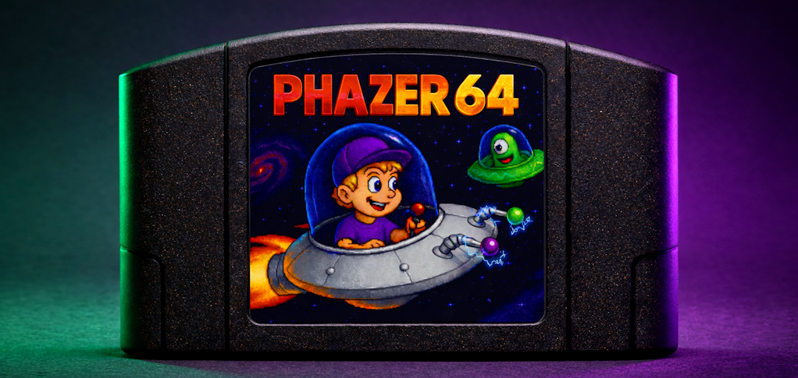
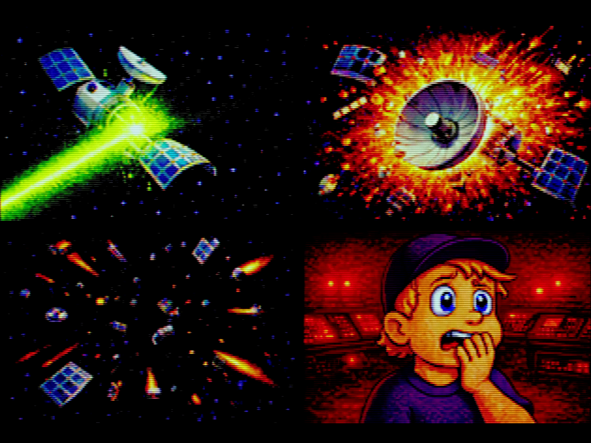
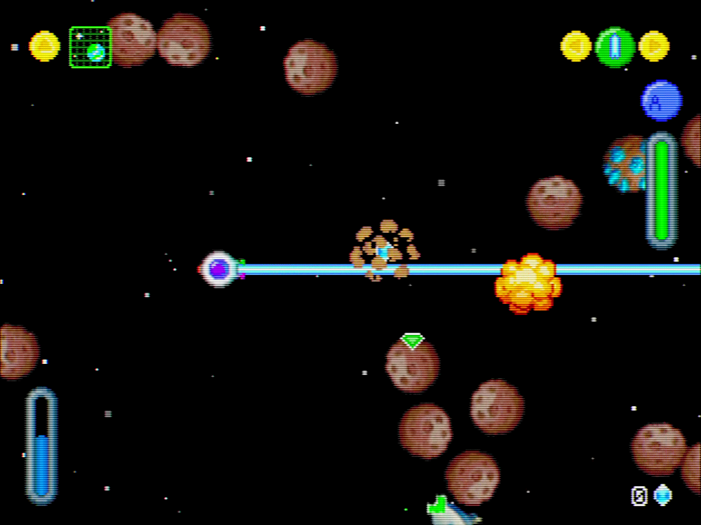
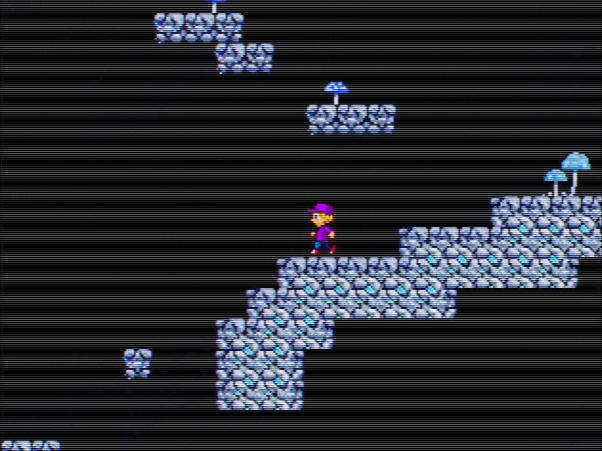
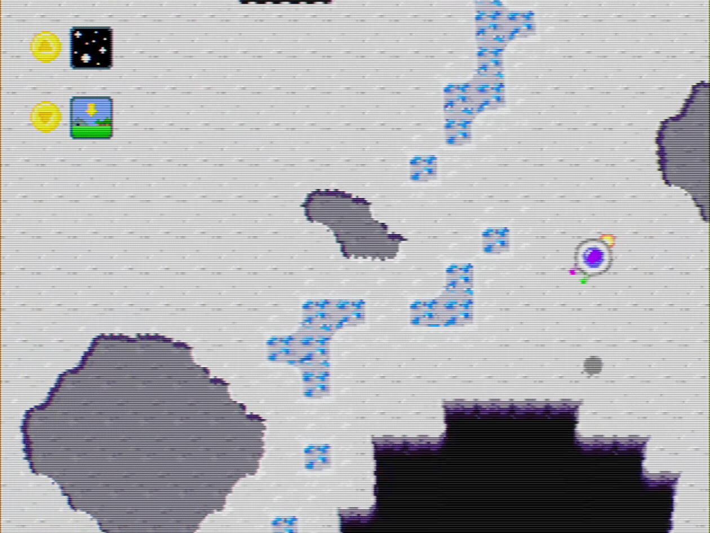
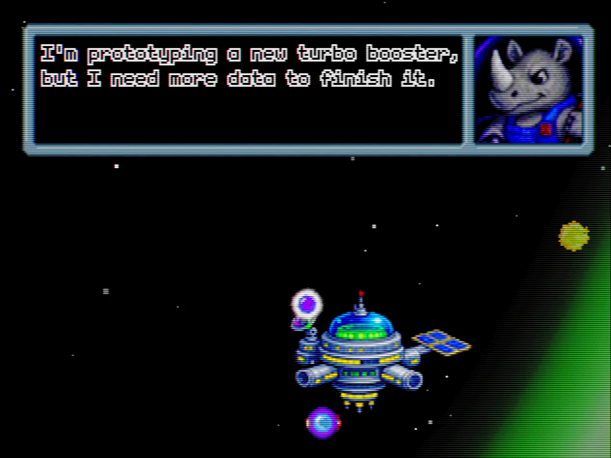
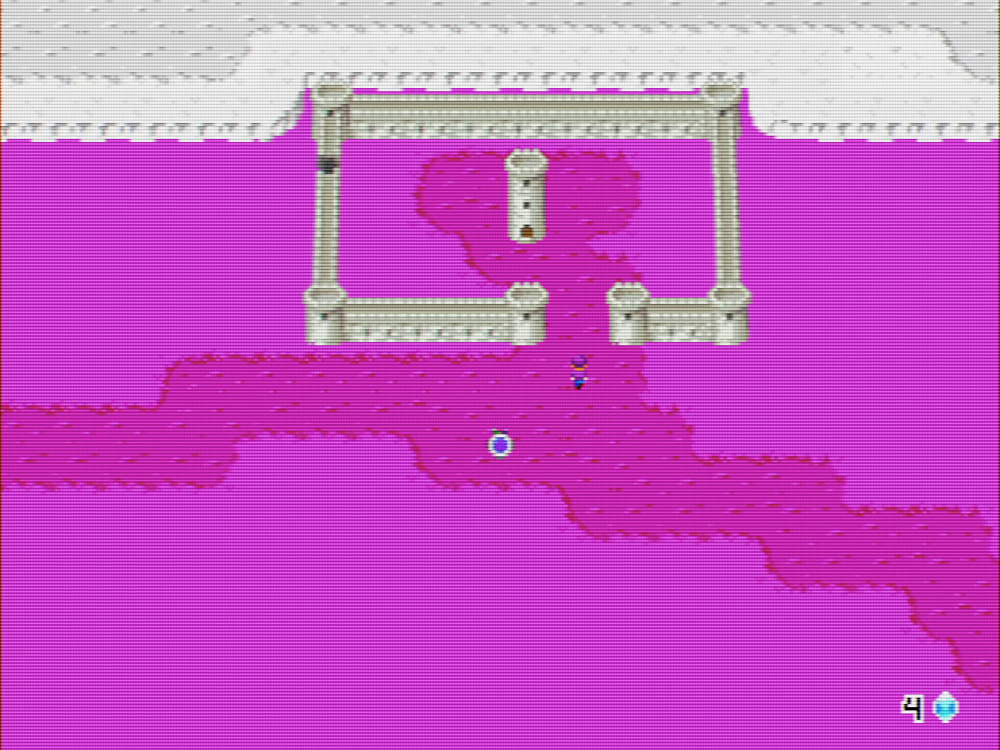
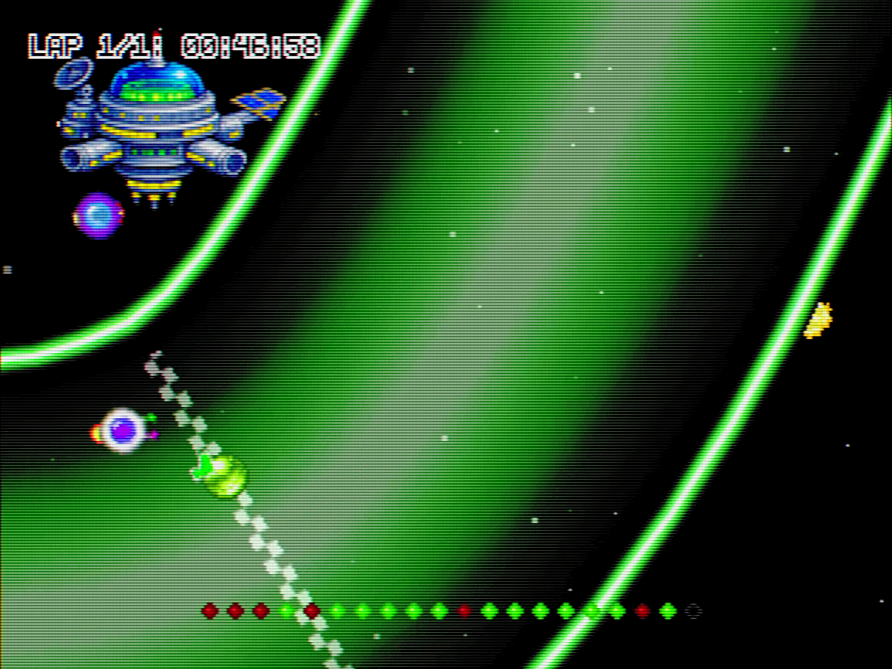

# Phazer 64

_One forbidden button. One blown-up satellite._  
_Zero time before Mom gets home!_

[Download (N64 ROM) via GitHub Releases](../../releases)  
[Download via Phazer 64 site](https://phazer64.com)

## About the Game

**Phazer 64** is a retro-flavored **2D space adventure** blending UFO action,
RPG exploration, and platforming - on Nintendo 64.

When a kid presses the forbidden button, Terra's main satellite gets blown up by
a powerful laser. **UH-OH!** (Yes, it was you.)

Good thing you've got a homemade UFO in the garage. You have to repair the
damage - before your parents come home and find out. **LET'S GO!**

Embark on an adventure through space. Meet new alien friends and explore strange
planets - both above and underground.

## Features

- Fly through **open space** and race tracks
- **Land on planets**, switch from flight to on-foot
- Explore **surface and underground areas**
- Collect **Star Nuggets** to fund upgrades
- Unlock **weapon systems** to blast asteroids
- Use your **space map** to find the **satellite pieces**
- Rebuild the satellite with a **tractor beam**

Will you convince Crankhorn, the galaxy's best mechanic, to install his new
tractor beam? Can you piece the satellite back together - or are you about to
get grounded for life?

## Media

You can watch a full playthrough on YouTube, but I recommend playing the game
yourself: https://www.youtube.com/watch?v=8dR-HCnk2dw

## N64 Features

- Runs on real Nintendo 64 hardware (PAL, NTSC)
- Fully compatible with the Ares emulator
- Stable 60 FPS on original hardware, including PAL60
- EEPROM save, overscan settings, and stick calibration
- Immersive stereo sound
- I recommend a SummerCart64 to play on hardware
- Made using libdragon for the #N64BrewJam 6

Note: this game is unofficial homebrew and in no way affiliated with or
endorsed by Nintendo.

## Why I made this game

This game is a love letter to Commander Keen and other games that inspired me
as a kid to become a game developer. People have described it as "Commander Keen
meets No Man's Sky" in spirit.

When playing the original Keen games, I remember being so frustrated that I
couldn't enter the spaceship and fly to new planets. When Commander Keen 4 fully
showed the ship for the first time, I probably spent hours trying to make it
fly.

When I worked on Phazer 64, at first it was supposed to be only a UFO in space
with a nice-looking starfield simulation. But when my son played the prototype,
he echoed that same sense of wonder. "Why can't I land on this planet? Why can't
I leave my UFO? Why can't I jump around?" My brain said: this is out of scope,
this is too much, don't do it. Yet, my heart remembered how I felt when I was a
kid, and my gut finally decided: it's a game jam, what could go wrong? Let's go!

So I built it. And now you can: travel, land, get out, explore, jump. The
technology is there, and the game jam release feels like the beginning of
something bigger.

The N64 is my favorite console. Its library of family-friendly games is colorful
and full of wonder, while still taking players seriously. That feels like a
great fit, and building on real hardware is magical.

If you want to play more Phazer 64 in the future or are interested in my
personal projects, you can sign up for my newsletter on https://coreproduction.de

The journey will continue.

## License

- **Source code:** MIT License (see `LICENSE`)
- **Game assets (art, audio, level/content):** Restricted license, non-commercial distribution only (see `assets/LICENSE_ASSETS.txt`); third-party asset exceptions are listed in `THIRD_PARTY_NOTICES.md` and must be obtained from the original authors (no reuse/redistribution from this repo)

## Attribution (appreciated)

If this was worthwhile to you, a credit is appreciated - and I'd love to hear from you!
"Johannes Roth Core Production — https://coreproduction.de"

## Credits

- libdragon (Nintendo 64 SDK): https://github.com/DragonMinded/libdragon
- N64Brew Discord Community: https://discord.gg/WqFgNWf
- Starfield assets: Helianthus Games (partially modified)
- Tilesheets: fliegevogel (partially modified)
- SquirrelNoise5: Squirrel Eiserloh — CC BY 3.0 US (see `THIRD_PARTY_NOTICES.md`)

## How to Build

I was using the libdragon CLI in combination with ares (to run). See build_and_run.bat on how to invoke it.

In the Makefile you can define:
Master Build = no FPS, no debug functionality
Release Build = FPS shown, no debug functionality
Both disable = DEV build -- use flags at top of phazer.c during development

## Notes on Audio

As I am using paid SFX assets in the finished ROM, they can't be included here. For this reason, all *.wavs are silent files.

## Notes on Helianthus Games Assets

As the assets are part of a paid asset, they've been modified with red lines every second row.
